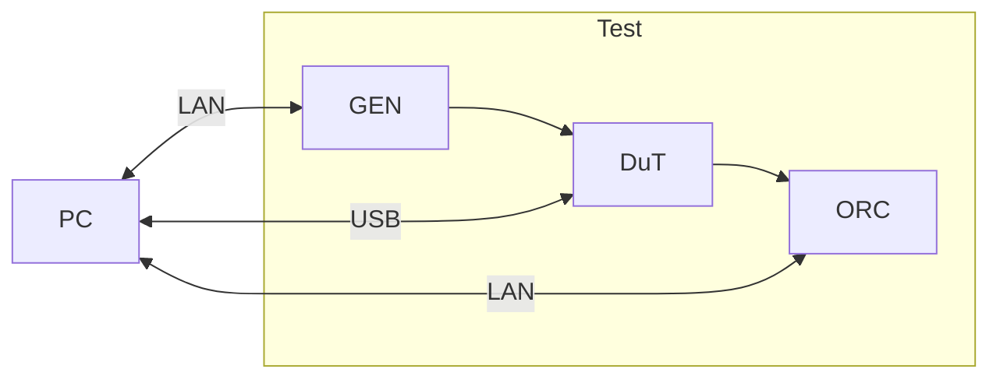
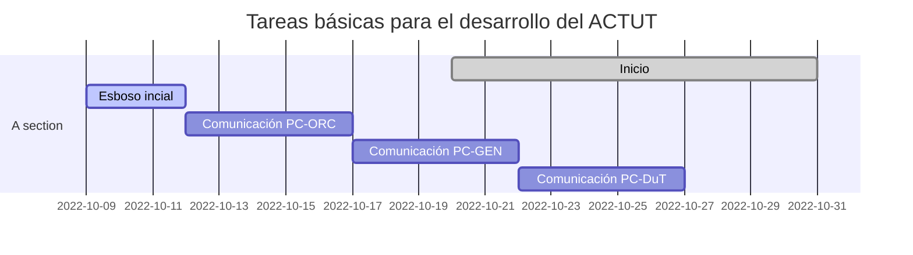

# Automated Calibration Tool UT

## Esquema básico

La configuración de setup del sistema está determinado por el siguiente esquema, puede dividirse en dos grupos, la parte de control que será articulada por la `PC` y la parte de TEST que está formada por el dispositivo bajo prueba `DUT`, el generador de señales `GEN` encargado de la exitación y el osciloscopio `ORC` para el registro de las mediciones y verificacion.

## Tareas básicas

